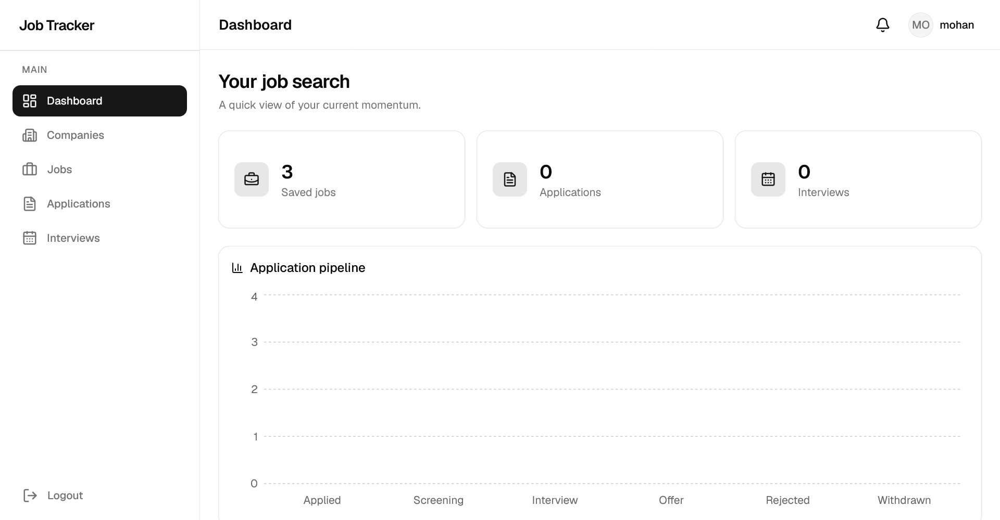
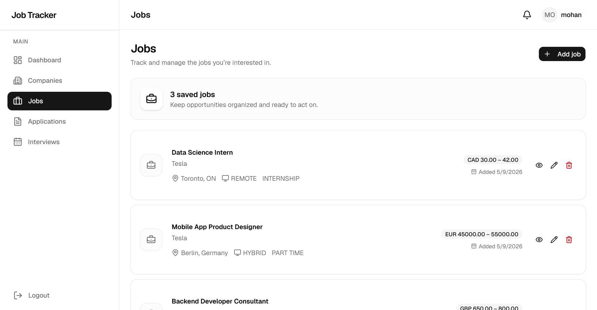

# Job Application Tracker Pro

A full-stack job application tracker for managing companies, jobs, applications, interviews, and application history.

**Live Demo:** https://job-tracker-vert-three.vercel.app/

## Dashboard

<p align="center">
  
</p>

### Jobs

<p align="center">
  
</p>

## Tech Stack

**Frontend**
- React + TypeScript + Vite
- Tailwind CSS + shadcn/ui
- React Router
- TanStack Query
- React Hook Form + Zod

**Backend**
- Node.js + Express + TypeScript
- PostgreSQL (`pg`)
- JWT + Argon2
- Zod

**Deployment**
- Vercel — Frontend
- Render — Backend
- Neon — PostgreSQL

## Features

- User registration and login
- JWT authentication with short-lived access tokens
- HttpOnly refresh-token cookies
- Refresh-token rotation and revocation
- Automatic session restoration
- Company CRUD
- Job CRUD
- Job filtering, sorting, and pagination
- Application status tracking
- Application history
- Interview tracking

## Architecture

The backend follows a layered architecture:

```text
Client
  ↓
Route
  ↓
Controller
  ↓
Service
  ↓
Repository
  ↓
PostgreSQL
```

- **Controllers** handle HTTP requests and responses.
- **Services** contain business logic.
- **Repositories** handle PostgreSQL queries.

## Database

Core relationships:

```text
users
 ├── companies
 │     └── jobs
 │          └── applications
 │               ├── application_history
 │               └── interviews
 └── refresh_tokens
```

The database uses foreign keys, unique constraints, check constraints, indexes, cascading deletes, transactions, and parameterized SQL queries.

Database changes are managed through versioned migrations.

## Authentication

The application uses two types of tokens:

- **Access token:** short-lived JWT stored in frontend memory.
- **Refresh token:** opaque token stored in an HttpOnly cookie. Only its hash is stored in PostgreSQL.

Refresh tokens are rotated when used and can be revoked during logout.

The frontend also uses a shared refresh promise to prevent multiple simultaneous requests from triggering independent token refreshes.

## API

Successful response:

```json
{
  "success": true,
  "message": "Operation completed successfully.",
  "data": {}
}
```

Error response:

```json
{
  "success": false,
  "message": "Something went wrong.",
  "error": {
    "code": "ERROR_CODE"
  }
}
```

Request validation is handled with Zod, and API errors are handled centrally.

## Project Structure

### Backend

```text
backend/src/
├── controllers/
├── middleware/
├── repositories/
├── routes/
├── services/
├── schemas/
├── db/
│   └── migrations/
├── types/
├── utils/
├── app.ts
└── server.ts
```

### Frontend

```text
frontend/src/
├── components/
├── features/
│   ├── auth/
│   ├── companies/
│   └── jobs/
├── layouts/
├── lib/
├── pages/
├── routes/
└── types/
```

## Getting Started

### Backend

```bash
cd backend
npm install
npm run migrate
npm run dev
```

Create `backend/.env`:

```env
NODE_ENV=development
PORT=3000
DATABASE_URL=your-postgresql-url
JWT_SECRET=your-secret
CORS_ORIGIN=http://localhost:5173
```

### Frontend

```bash
cd frontend
npm install
npm run dev
```

Create `frontend/.env`:

```env
VITE_API_URL=http://localhost:3000/api
```

## Deployment

```text
GitHub
 ├── Frontend → Vercel
 └── Backend  → Render → Neon PostgreSQL
```

Production configuration uses environment variables for API URLs, database credentials, JWT secrets, and CORS.

## Future Improvements

- Dashboard analytics
- Complete application management UI
- Interview management UI
- Application timeline
- Automated testing
- Advanced search and statistics

## Author

**Rohit Kumar**

Full-Stack Developer
